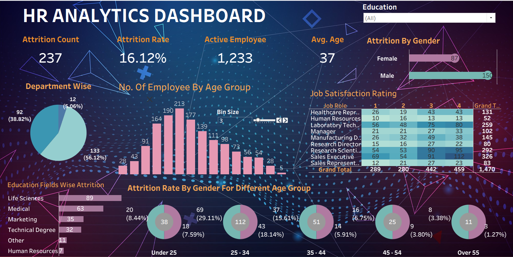

# 📊 HR Analytics Dashboard (Tableau)
A Tableau dashboard providing insights into employee attrition by age, gender, department, and job satisfaction to support HR retention strategies.

## 🎯 Project Objective  
The goal of this project is to analyze employee attrition across multiple dimensions such as **age, gender, department, education field, and job role**.  
This dashboard enables HR professionals to uncover workforce insights and design effective retention strategies.

---

## 📂 Dataset Used  
- **Dataset:** HR Analytics Employee Attrition Dataset  
- **Source:** Public HR Dataset (Kaggle / Sample HR Data)  
- **Key Columns:**  
  - Employee ID  
  - Age  
  - Gender  
  - Department  
  - Education Field  
  - Job Role  
  - Attrition (Yes/No)  
  - Job Satisfaction  
  - Years at Company  

---

## ❓ Key Questions (KPIs)  
✔️ How many employees have left the company?  
✔️ What is the overall attrition rate?  
✔️ What is the average employee age?  
✔️ Which gender faces higher attrition?  
✔️ Which departments and education fields have the highest attrition?  
✔️ How satisfied are employees in different job roles?  
✔️ Which age groups are most affected by attrition?  

---

## ⚙️ Process & Dashboard Design  

1. **Data Cleaning & Preparation**  
   - Removed nulls and standardized categories.  
   - Created calculated fields for attrition rate, active employees, and age bins.  

2. **Dashboard Features in Tableau**  
   - **KPIs Overview** – Attrition Count, Attrition Rate, Active Employees, Avg. Age.  
   - **Visualizations**:  
     - Pie Chart → Department-wise attrition  
     - Histogram → Employee age distribution  
     - Bar Charts → Gender-wise & Education-wise attrition  
     - Donut Charts → Attrition by age groups  
     - Heatmap → Job satisfaction ratings by role  
   - **Filters** → Education filter for drill-down analysis  

---

## 🔎 Key Insights  

- **Attrition Count:** 237 employees  
- **Attrition Rate:** 16.12%  
- **Active Employees:** 1,233  
- **Average Age:** 37 years  

📌 **Major Findings**  
- Male attrition (150) > Female attrition (87).  
- R&D and Sales departments face the highest attrition.  
- Life Sciences (89) and Medical (63) backgrounds contribute heavily to attrition.  
- Employees aged **25–34** are most vulnerable (112 employees).  
- Job satisfaction is lowest among Sales Executives and Lab Technicians.  

---

## ✅ Final Conclusion  

The HR Analytics Dashboard reveals critical attrition patterns:  
- Younger employees (25–34) and males show higher turnover.  
- Specific departments (R&D, Sales) and education fields (Life Sciences, Medical) need targeted retention programs.  
- Job satisfaction strongly impacts attrition and should be prioritized for improvement.  

**Recommendation:**  
- Build tailored retention strategies for high-risk groups.  
- Enhance job satisfaction programs in vulnerable roles.  
- Focus on career growth opportunities for younger employees.  

---

## 🚀 Tools & Technology  
- **Data Visualization:** Tableau  
- **Data Processing:** Excel / CSV preprocessing  
- **Platform:** Tableau Desktop Public Edition  

---

## 📌 Dashboard Link  
🔗 [View Interactive Dashboard on Tableau Public](#) *()*  

---

## 👨‍💻 Author  
**Abhishek Kumar**  
🌐 https://www.linkedin.com/in/abhishek-kumar-409ab91b4/ 
